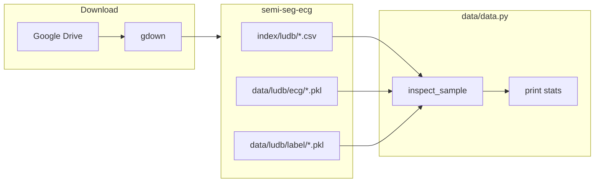
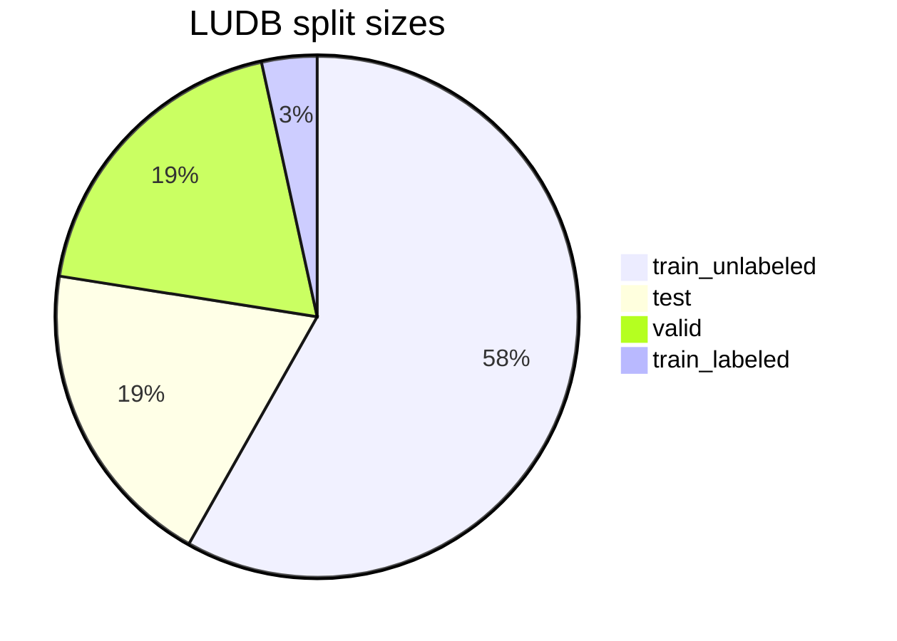
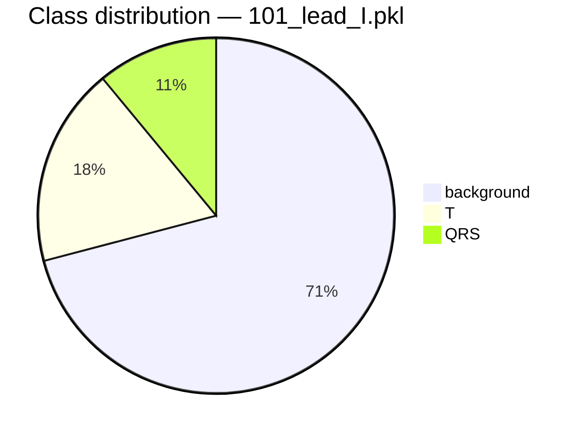

# LUDB Data Loader

Inspect and download the [SemiSegECG](https://github.com/vuno/semi-seg-ecg) LUDB benchmark data.

`data.py` downloads preprocessed ECG waveforms and segmentation labels, then prints split sizes and sample metadata — no PyTorch required.

## Quick start

```bash
cd ~/Desktop/safe

# One-time dependencies
pip install numpy pandas gdown

# Download + inspect
python data/data.py --download

# Inspect only (after download)
python data/data.py
```

### CLI options

| Flag | Default | Description |
|------|---------|-------------|
| `--download` | off | Download LUDB from Google Drive before inspecting |
| `--label-fraction` | `16` | Labeled split size: `2`, `4`, `8`, or `16` (higher = fewer labels) |
| `--dataset` | `ludb` | Dataset name (only LUDB supported for now) |

```bash
python data/data.py --label-fraction 8
```

## Split audit

Validate the **official benchmark splits** for leakage and print summary stats. Does not create new splits.

```bash
cd ~/Desktop/safe
python data/audit.py
python data/audit.py --label-fraction 8
```

Checks:

- Row counts, unique waveforms, unique patient IDs, and percentages per split
- **Critical (must be 0):** patient ID and waveform overlap between train vs valid/test, and valid vs test
- **Informational:** overlap between `train_labeled` and `train_unlabeled` (expected in semi-supervised setup)

Expected result: `AUDIT PASSED — no leakage between train and eval splits.`

## Data layout

After download, files live under `semi-seg-ecg/`:

```
semi-seg-ecg/
├── data/ludb/
│   ├── ecg/       # waveform .pkl  — np.ndarray (T,) float
│   └── label/     # segmentation .pkl — np.ndarray (T,) int {0,1,2,3}
└── index/ludb/
    ├── LUDB_train_labeled_1over16.csv
    ├── LUDB_train_unlabeled.csv
    ├── LUDB_valid.csv
    └── LUDB_test.csv
```

Index CSV columns: `waveform`, `label`, `sample_rate`, `ID`.

### Segmentation classes

| Value | Class |
|-------|-------|
| 0 | background |
| 1 | P wave |
| 2 | QRS complex |
| 3 | T wave |

## Data flow



## LUDB results (1/16 labels)

Verified run on local machine:

### Split sizes

| Split | Samples | Index file |
|-------|---------|------------|
| train_labeled | 84 | `LUDB_train_labeled_1over16.csv` |
| train_unlabeled | 1,427 | `LUDB_train_unlabeled.csv` |
| valid | 468 | `LUDB_valid.csv` |
| test | 474 | `LUDB_test.csv` |

On disk: **2,369** ECG `.pkl` files and **2,369** label `.pkl` files.



The small labeled set (84) vs large unlabeled pool (1,427) is intentional — this benchmark studies **semi-supervised** ECG delineation.

### Sample inspection: `101_lead_I.pkl` (first train_labeled row)

| Property | Value |
|----------|-------|
| ECG shape | `(5000,)` |
| ECG dtype | `float64` |
| ECG range | [-0.1698, 0.8302] |
| ECG mean ± std | -0.0018 ± 0.1122 |
| Label shape | `(5000,)` |
| Sample rate (index) | 500 Hz → 10 s of signal |



Most timesteps are background (~71%) — typical for waveform segmentation. This sample has no P wave segment in the window.

### Unlabeled sample: `1_lead_I.pkl`

| Property | Value |
|----------|-------|
| ECG shape | `(5000,)` |
| ECG dtype | `float64` |
| Labels | not loaded (unlabeled split) |

## Raw vs training signal length

| Stage | Length | Sample rate |
|-------|--------|-------------|
| Raw `.pkl` files | 5,000 samples | 500 Hz |
| Training config (`semi-seg-ecg`) | 2,500 samples | 250 Hz (resampled + filtered) |

`data.py` inspects **raw** files. The training pipeline in `semi-seg-ecg` resamples and bandpass-filters before the model sees data.

## Troubleshooting

| Error | Fix |
|-------|-----|
| `No module named 'pandas'` | `pip install numpy pandas gdown` |
| `Cannot inspect — run with --download first` | `python data/data.py --download` |
| `python: command not found` | Use `python3 data/data.py` |

## Related

- Benchmark repo: [`semi-seg-ecg/`](../semi-seg-ecg/)
- Paper: [SemiSegECG (CIKM 2025)](https://dl.acm.org/doi/10.1145/3746252.3760790)
